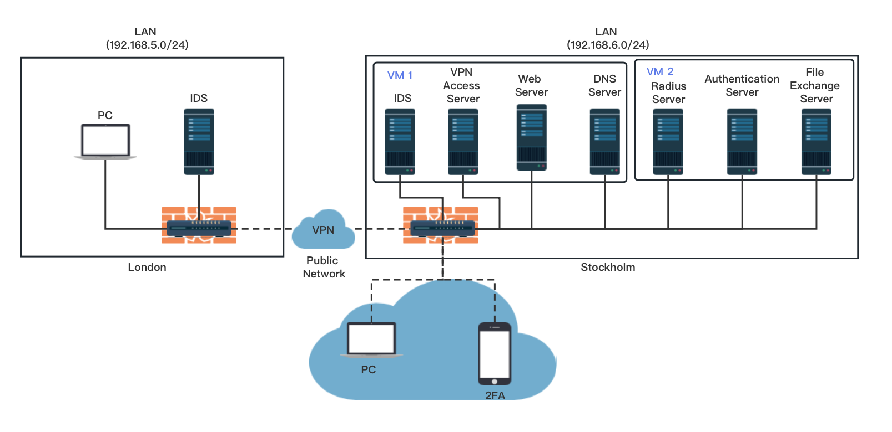

# EP2520-Building-Networked-Systems-Security-Project

## Network Structure



## OpenWRT

We found the corresponding OpenWRT version of the router according to the official OpenWRT documentation, [here](https://openwrt.org/downloads), and flashed the router according to the [steps](https://openwrt.org/docs/guide-user/installation/generic.flashing) in the documentation. After installing OpenWRT, you can access the Web UI of the router through the default **192.168.1.1**. Next, we go to **Network** -> **Interfaces** -> **LAN** to set it to a static address. For London router -> 192.168.5.1/24 and for Stockholm router -> 192.168.6.1/24. To set up wireless encryption you can refer to the Freeradius section.

## OpenVPN

### VPN Access Server

First we need a virtual machine with Ubuntu and an OpenVPN account for downloading OpenVPN Access Server [Openvpn-as](https://openvpn.net/access-server/). Run the commands provided by the openvpn website in our virtual machine as root.

```sh
apt update
apt -y install ca-certificates wget net-tools gnupg

wget https://as-repository.openvpn.net/as-repo-public.asc -qO /etc/apt/trusted.gpg.d/as-repository.asc

echo "deb [arch=amd64 signed-by=/etc/apt/trusted.gpg.d/as-repository.asc] http://as-repository.openvpn.net/as/debian jammy main">/etc/apt/sources.list.d/openvpn-as-repo.list

apt update
apt -y install openvpn-as
```

Once the installation is complete, you will be given your admin account and password and you should now be able to access the web interface of [https://localhost:943/admin](https://localhost:943/admin) OpenVPN Access Server to create a VPN client. Go to **Network Setting**, enter the public IP address of the VM in Hostname or IP Address, then go to **VPN Setting**, enter 192.168.9.0 in Network Address, so that our client will be assigned the IP when connecting. Finally, go to **User Permissions**, where we can add the vpn client's information, including username and password, and set **Require MFA** to Enabled.

Then, we should set up port forwarding on the router to forward packets with destination ports 1194 and 943 to ports 1194 and 943 of the VM with OpenVPN Access Server installed. This is done by entering the router's luci interface (192.168.6.1), finding **port forwards** in **firewall**, and adding a new rule to forward packets arriving at the router with ports 1194 and 943 to the VM in the LAN (192.168.6.113).

Now the client will be able to access the OpenVPN server and download the login credentials (.ovpn file) via [https://111.222.333.444:943](https://111.222.333.444:943) (Replace 111.222.333.444 with the router public IP). The user can use these credentials on PC or mobile to connect to the openVPN application by entering the password and 2FA. At this point, VPN users will be able to access other servers in the Stockholm LAN, such as the file transfer server.

### Router VPN

We set up a dedicated VPN between the two routers.

**Stockholm Router (Server):** We used the official OpenWRT tutorial ([here](https://openwrt.org/docs/guide-user/services/vpn/openvpn/server)) to configure the VPN server on Stockholm's router. there are several parts to it (Preparation, Key management and Firewall). It is worth noting that we have to change its default port 1194 to port 1195 to avoid conflicts with OpenVPN Access Server. Then we can install the openvpn option for the web ([here](https://openwrt.org/docs/guide-user/services/vpn/openvpn/extras)), after which we can view the VPN configuration on the web UI.

**London Router (Client):** We can configure the router client according to the tutorial on the OpenWRT website ([here](https://openwrt.org/docs/guide-user/services/vpn/openvpn/client)) and copy the contents of the client.ovpn generated in the VPN server (Stockholm router) to the London Router configuration (/etc/ openvpn/client.conf). Then we go to the Web UI of the London server (192.168.5.1), go to **VPN** -> **OpenVPN** and just open the VPN service. This should allow you to successfully access the server in Stockholm LAN via VPN.

## Web Servers

We set up two Web services, one of which is a normal Web service and the second is a Critical Web service (which does not allow access to external VPN users). And, we installed Web Servers and OpenVPN Access Server on the same VM (192.168.6.113).

**Normal Web Service: **

```shell
sudo apt-get install apache2
sudo systemctl start apache2
```

The web service will be opened on the default port **80** and the web interface will be accessible when the user accesses 192.168.6.113:80.

### Critical Web Service:

We install **docker** in the VM and pull the httpd image and create the container so that the container web service maps to port **8080** of the VM.

```shell
sudo apt-get install docker.io
docker pull httpd

docker run -dit --name Criptical-Server -p 8080:80 -v "$PWD":/usr/local/apache2/htdocs/ httpd
```

To block access from external VPN clients, we use **iptables** on the VM to drop packets from VPN clients.

```shell
iptables -I INPUT -s 192.168.9.0/24 -d 192.168.6.113 -p tcp --dport 8080 -j DROP
```


## Nextcloud

Since we use Docker Desktop for our Nextcloud server container. We need to download some essential software. First, we need to download Docker Desktop for windows. Make sure your computer have Hyper-V installed. Then, your Docker Desktop should work just fine. 

Now, we need to download Nextcloud image. In your windows terminal, type:

```shell
docker pull nextcloud
```

It should use default tag: "latest" and download the image. Now, you should see there is a nextcloud image in your Docker Desktop. The next step is making it run. Again, in your windows terminal type:

```shell
sudo docker run -d -p 9006:80 -v " " nextcloud
```

The content in quotes should be the directory where the data is stored on your computer. Also, we just set port 80 mapping to 9006(your choice). In Docker Desktop image, run your nextcloud image. In the pop-up setting window, configure the container name as nextcloud, ports as 9006 and set the host path and container path properly. Finally, type: localhost:9006 , you should see the Nextcloud page. After that, you should configure your profile and start to enable applications to fulfill your purposes.

If you wish someone else from other network can access the server, you should also configure the config.php. In the config.php, find "trust domain" and add whatever address that you wish to be able to access the server.

## Freeradius

For Freeradius set-up, I recommend that try freeradius's getting started page. Before the configuration, you should make sure the router supports WAP/WAP2-EAP encryption. For example, we use OpenWRT to download wpad software for router. Also, it is very important since we use virtual machine that choose bridge connect so that radius server's IP address will be at the same network as computer.\\We deploy our server in a virtual machine with a Linux Ubuntu system. The very first thing is install the server. There are a lot of ways to do it. We think the easiest way is using apt-get command. Make sure update first

```shell
apt-get update
apt-get install freeradius
```

Now, the server should be installed successfully. Use the following command to start debug mode

```shell
freeradius -X
```

You should see "Ready to process requests". If not, you can also see what is wrong in debug mode. If it works fine, type the command below or **Ctrl+C** to end the service.

```shell
service freeradius stop
```

Now, we should edit client.conf to set the router as NAS. Under directory /etc/freeradius/3.0.

```shell
vim client.conf
```

Just add your router in the configuration file.

```shell
client router {
        ipaddr = 192.168.6.1
        secret = freeradius
    }
```

Then, add some employees representing those try to access the wireless network. Still under directory /etc/freeradius/3.0.

```shell
vim users
```

```shell
frank Cleartext-Password := "password"
joey  Cleartext-Password := "password"
...
```

Don't set weak passwords as I do since it is just for the demo. It should be able to preform authentication over wireless connection now. In OpenWRT, under wireless network setting, set the radius server's IP address as 192.168.6.148 and port as default 1812 as well as password "freeradius". Now, users can connect to the wireless network with radius server authentication.

## OpenSSL

OpenSSL is used with default extensions to distinguish the type and purpose of files. The following shell script codes display procedure outline of certificates distribution and emulated authentication e.t.c. (Full codes and notes in repositories.) 

Note certificate is prerequisite even if user account and password are hold. Certificate is not bind with user’s identity nor machine, but only with private key. Therefore, private key should be stored locally and ought **NOT** be transmitted. Immediately revoked if leaked and re-requested if lost. The realization is mainly for demo and not much efficient, but the structure can be inherited in further developments.

 (This [link](https://www.golinuxcloud.com/tutorial-pki-certificates-authority-ocsp/) is a pratical tutorial.)

### File Type
All files use PEM format as default. The extensions indicate the types of file, note as following:

- `*.key` Private Key
- `*.pem` Certificate or Certificate chain file
- `*.p12` PKCS #12 archive file format (key and cert)
- `*.csr` Certificate signing request (CSR)
- `*.cnf` Configuration File
- `*.crl` Certificate revocation list (CRL)
- `*.vrfy` Certificate Verification
- `serial crlnumber ...` ANSI standard number file for CA
- `index.txt` Certificate database for CA
- `*.old` Backup file
- `*.attr` Attributes file

Notice that all files in demo are generated under local directory for instance. Directory should be identified and set properly under further developments. 

### CA

First, `ROOT_SELF_SIGNED_CERT_GEN.sh` is to generate certificate a self-signed root CA and intermediate CA for test, which can be replaced if a real root CA’s certificate is povided. After running it, root CA’s key and self-signed certificate would appear, and so do intermediate CA's. (`cert-bundle.pem` is the certificate chain.) Test running:

```txt
Press enter to continue: All *.pem *.csr would be removed!
Press enter to continue: Check OpenSSL verion (locally)
OpenSSL 3.0.2 15 Mar 2022 (Library: OpenSSL 3.0.2 15 Mar 2022)
Press enter to continue: 1. Generate ROOT's private key and self-signed.pemtificate
Press enter to continue: 2. Generate CA server's private key and certificate signing request (CSR)
You are about to be asked to enter information that will be incorporated into your certificate request.
...
Press enter to continue: 3. Use ROOT's private key to sign CA server's CSR and get back the signed certificate
Certificate request self-signature ok
subject=C = SE, ST = Stockholm, L = Stockholm, O = ACME, OU = headquater, CN = ca.demo.com, emailAddress = info@demo.com
Certificate chain has been generated.
```

Second, `CA_GEN.sh` is designed for CA to manually locally grant a single new user’s key and certificate. Some field must be filled accordingly to avoid verification failure. After running it, user's key and certificate (and p12 file) would appear and intermediate CA's database would be renewed. (`cert-bundle_new.pem` is the new certificate chain containing user's certificate.) Test running:

```txt
Input DIR for CA's cert and certificate chain. (e.g.:/home/usr) Ending with NO slash "\"
(The CA key must name "ca.key". The chain must name "cert-bundle.pem". Failed if not found.)
Current dir used if omitted:
CA Key File Found. Chain File Found. 
...
Input name for key or certificate file (e.g.:"server")
Use "client" if omitted:
...
Input DIR for client's key and generating CSR.
 (The key must name client.key. If key is not found, it'll be generated.)
Current dir used if omitted:
File "client.key" Not Found. Generating...
...
If you have configuration file, make sure it under "./".
 (The configuration must name client.cnf. )
File "client.cnf" Not Found. Use default.
Default CN:user.demo.com, email:info@demo.com
Input common name (CN), default if omitted:
...
client.csr is under "./". Sending to CA...
Using configuration from ./ca.cnf
Check that the request matches the signature
Signature ok
Certificate Details:
        Serial Number: ...
        Validity
            Not Before: ...
            Not After : ...
        Subject:
           ...
Certificate is to be certified until ... (365 days)
Write out database with 1 new entries
Data Base Updated
...
client.pem is under "./".
Type any character to skip seeing certificate "client.pem":
Certificate:
    Data: ...
    Signature Algorithm: md5WithRSAEncryption
    Signature Value:
        b7:2f:11:d3:33:29:c7:ab:af:ea:67:ca:b3:1d:1c:25:30:...
./cert-bundle_new.pem: OK
...
Type any character to skip generating "client.p12":
Enter Export Password:
Verifying - Enter Export Password:
Complete!
```

Third, `CA_CRL.sh` is for CA to revoke a certain certificate and maintain a CRL. After running it, the target certificate would be revoked and intermediate CA's CRL would be updated. Test running:

```txt
Enter certificate to revoke (e.g. client.pem):
Use default [client.pem]
Using configuration from ca.cnf
Revoking Certificate 00.
Data Base Updated
...
Press enter to continue: CRL generation
Using configuration from ca.cnf
...
Press enter to continue: CRL view
Certificate Revocation List (CRL):
        Version 2 (0x1)
        Signature Algorithm: md5WithRSAEncryption
        Issuer: ...
        Last Update: ...
        Next Update: ...
        CRL extensions:
            X509v3 CRL Number: ...
Revoked Certificates:
    Serial Number: 00
        Revocation Date: ...
    Signature Algorithm: md5WithRSAEncryption
    Signature Value:
        29:40:6f:a2:fe:50:6c:d6:60:6f:d6:31:5c:9c:eb:70:ea:...
```

Last but not least, `CLEAN.sh` is to clean up all the affiliative files generated (not including `ca.cnf`, which is the initial file). Test running:

```txt
Press Enter to clean up all files generated.
removed '00.pem'
...
Complete!
```

All above shell scripts have been added some robustness condition for tests.

Notice that in the second step, it can be reformed easily to bash process a list of users with an information list (Not implemented). `CA_GEN_CERT.sh` (Deprecated) is for CA using client-server mode to listen to a fixed server port and receive CSR with `nc` command, and to sign certificates. (It can realize the separation of CA and requested users. For better demo.)

`CA_old.sh` (Deprecated) is a very initial version of the implementation of CA, which is trying to use a Raspberry Pi 4 as a remote SSH CA server.

### Client

Client can install its key and certificate in a p12 format file to get connect to servers automatically. 

In original proposal, if a new client with no certificate arrives, one can be requested by `CLIENT_GET_CERT.sh` (Deprecated) with the co-orperation of `CA_GEN_CERT.sh` (Deprecated), through `nc` command. With it, client can generate CSR with its key and subject information, send it to CA as its IP address (or domain name, if DNS installed) is pre-configured, and get back its signed certificate. (For better demo.)

If a client wants to access a server, it must finish mutual authentication which can be tested with a TLS handshake given by `CLIENT_TEST_TLS.sh` (Shown below).

```shell
read -p "Input server's IP" SERVER_IP
openssl s_client -connect $SERVER_IP:4433 -servername server -brief -cert client.pem -key client.key -verify_return_error -state -CAfile root.pem
```

### Server

Similarly, server needs to install its key and certificate to certain directory. Server has to well configure corresponding directory and path to enable SSL authentication, which is built-in in different application’s configuration file. Configuration steps may vary.

Take *Apache2* as example, it has a set up of `default-ssl.conf` and an add on `ssl-param.conf` if needed. If setting the field `SSLCertificateVerification = required`, when a client try to access the web server by HTTPS, it should be required for selecting its certificate in a pop-in window of browser (if the p12 file is installed). If not satisfied, connection would be refused. (Refer to this [link](https://www.arubacloud.com/tutorial/how-to-enable-https-protocol-with-apache-2-on-ubuntu-20-04.aspx) or any other tutorials else)

Server and client’s mutual authentication can be tested with a TLS handshake given by `SERVER_TEST_TLS.sh` (Shown below), in which the HTTP field can be set as web-server’s IP for client trying to fetch.

```shell
read -p "web-server's IP" WEB_IP
openssl s_server -cert server.pem -key server.key -state -Verify 5 -CAfile root.pem -HTTP $WEB_IP -verify_return_error
```

If you decide to run your own server for particular usage, you may need a more foundamental programming. Server has to run an authenticator `SERVER_AUTH` in background to perfrom TLS then grant permission to further operations, which is programmed and generated by C. (Demo code shown below. Refer to this [link](https://wiki.openssl.org/index.php/Simple_TLS_Server)) 

```c++
// ...
int main(int argc, char **argv)
{
    get_current_directory(); ctx = create_context();
    configure_context(ctx); sock = create_socket(4433);
    /* Handle connections */
    while(1) {
        struct sockaddr_in addr; unsigned int len = sizeof(addr); SSL *ssl;
        int client = accept(sock, (struct sockaddr*)&addr, &len);
        if (client < 0) { perror("Unable to accept"); exit(EXIT_FAILURE); }
        ssl = SSL_new(ctx); SSL_set_accept_state(ssl); SSL_set_fd(ssl, client);
        SSL_set_verify(ssl, SSL_VERIFY_PEER | SSL_VERIFY_FAIL_IF_NO_PEER_CERT, NULL);
        if (SSL_accept(ssl) <= 0) { ERR_print_errors_fp(stderr); /* Handshake failed. */} 
        else { // Handshanke success. 
            int res = SSL_get_verify_result(ssl); 
            if (!(X509_V_OK == res)) { fprintf(stdout, "Verify Failed\n"); }
            else { fprintf(stdout, "Verify Successful\n");
                /* Authentication Success! Do Next. */}
        }
        SSL_shutdown(ssl); SSL_free(ssl); close(client);
    }
    close(sock); SSL_CTX_free(ctx);
}
```

P.S.1: Author who took charge of this part was trying to figure this out but eventually failed doing so. It also took great effort to install VScode server on Ubuntu server and remote program it on local Windows with C. :(

P.S.2: `Makefile` is also a good implementation of OpenSSL initialization given by *FreeRadius*. Too bad for author having trouble learning to configure it. :(


## Snort

### Installation and Configuration

Firstly, we used Ubuntu20.10 as the virtual machine and SNORT2.9.20 to deploy IDS server, run the following commands to install dependencies on the virtual machine before installing SNORT.

```shell
sudo apt-get install -y build-essential libpcap-dev libpcre3-dev libdumbnet-dev bison flex zlib1g-dev liblzma-dev openssl libssl-dev

sudo apt-get install -y libnghttp2-dev
wget https://snort.org/downloads/snort/daq-2.0.6.tar.gz
tar -xvzf daq-2.0.6.tar.gz
cd daq-2.0.6
./configure
make
sudo make install
```

Then Install Snort,

```shell
cd ~/snort_src
wget https://snort.org/downloads/snort/snort-2.9.9.0.tar.gz
tar -xvzf snort-2.9.9.0.tar.gz
cd snort-2.9.9.0
./configure --enable-sourcefire
make
sudo make install
sudo ldconfig
sudo ln -s /usr/local/bin/snort /usr/sbin/snort
```

Once the installation is complete, we need to create new files and folder that SNORT needs and modify the permissions of the files and folders. Now we can download some ruleset files form SNORT website or edit our own local.rules file, and move these rule files to /etc/snort/rules,which is the path that stores SNORT detection rules. Then we can start to edit our SNORT configuration document.

Firstly, we need to configure the snort.conf where the user can specify the subnet of which to analyze traffic. We change the subnet information in this file:

```shell
ipvar HOME_NET 192.168.6.0/24
ipvar EXTERNAL_NET !$HOME_NET
```

Secondly, we need to tell SNORT all the locations of the rule files we created and edit in snort.conf file:

```shell
var RULE_PATH /etc/snort/rules          
var SO_RULE_PATH /etc/snort/so_rules        
var PREPROC_RULE_PATH /etc/snort/preproc_rules   
var WHITE_LIST_PATH /etc/snort/rules/iplists    
var BLACK_LIST_PATH /etc/snort/rules/iplists    
```

Thirdly, enable rule file in snort.conf, such as:

```shell
include $RULE_PATH/local.rule
```

Then we can test and run Snort.

### Test and Run

Snort can also be tested explicitly with the following command:

```shell
sudo snort -T -c /etc/snort/snort.conf -i enp0s3
```

Make sure to correct the network interface that we try to listen to. After Snort successfully validated the configuration, we start to run:

```shell
snort -i enp0s3 -c /etc/snort/snort.conf -A fast
```

Then we can see the alert log file in /var/log/snort/ path.

## Bind9

We need a virtual machine with ubuntu20.10 to install BIND9:

```shell
apt install bind9 dnsutils
```

BIND9 will create a path /etc/bind/ to create and store configuration files.

Then we can configure vim named.conf.options file firstly,

```java
options {
        directory "/var/cache/bind";
        listen-on port 53 { any; }; // 
        allow-query { any; }; //
        // If there is a firewall between you and nameservers you want
        // to talk to, you may need to fix the firewall to allow multiple
        // ports to talk.  See http://www.kb.cert.org/vuls/id/800113
 
        // If your ISP provided one or more IP addresses for stable
        // nameservers, you probably want to use them as forwarders.
        // Uncomment the following block, and insert the addresses replacing
        // the all-0's placeholder.
         forwarders {
                223.5.5.5;
                223.6.6.6;
                //114.114.114.114;
         };
        //========================================================================
        // If BIND logs error messages about the root key being expired,
        // you will need to update your keys.  See https://www.isc.org/bind-keys
        //========================================================================
        dnssec-validation auto;//auto
        auth-nxdomain no;//
        //listen-on-v6 { any; };
        //include "/etc/rndc.key";
};
```

Then configure named.conf.local file to be certained about zones,

```java
//
// Do any local configuration here
//
// Consider adding the 1918 zones here, if they are not used in your organization
// include "/etc/bind/zones.rfc1918";

zone "demo.com" {   
        type master;
        file "/etc/bind/db.demo.com";  
};

zone "168.192.in-addr.arpa"  {
    type master;
    file "/etc/bind/db.168.192";
};
```

Then we should configure db.demo.com and db.168.192 to achieve Forward parsing and reverse parsing,

```shell
;
; BIND data file for local loopback interface
;

$TTL    604800
@       IN      SOA     demo.com. root.demo.com. (
                              2         ; Serial
                         604800         ; Refresh
                          86400         ; Retry
                        2419200         ; Expire
                         604800 )       ; Negative Cache TTL
;
@       IN      NS      localhost.
@       IN      A       192.168.6.233
web     IN      A       192.168.6.113
;@      IN      AAAA    ::1
* IN  A  192.168.6.233   ;
```

```shell
; BIND reverse data file for local loopback interface
;

$TTL    604800
@       IN      SOA     demo.com. root.demo.com. (
                              1         ; Serial
                         604800         ; Refresh
                          86400         ; Retry
                        2419200         ; Expire
                         604800 )       ; Negative Cache TTL
;
@       IN      NS      localhost.
1.0.0   IN      PTR     localhost.
233.6 IN PTR demo.com   ;
113.6.168.192.in-addr.arpa.  IN	  PTR	  web.demo.com
```

The configuration is initially complete, restart the bind service, then we can go to the hosts in the Stockholm, and modify their resolv.conf file to change the IP address of DNS server. After that, we achieve basic function of DNS server.